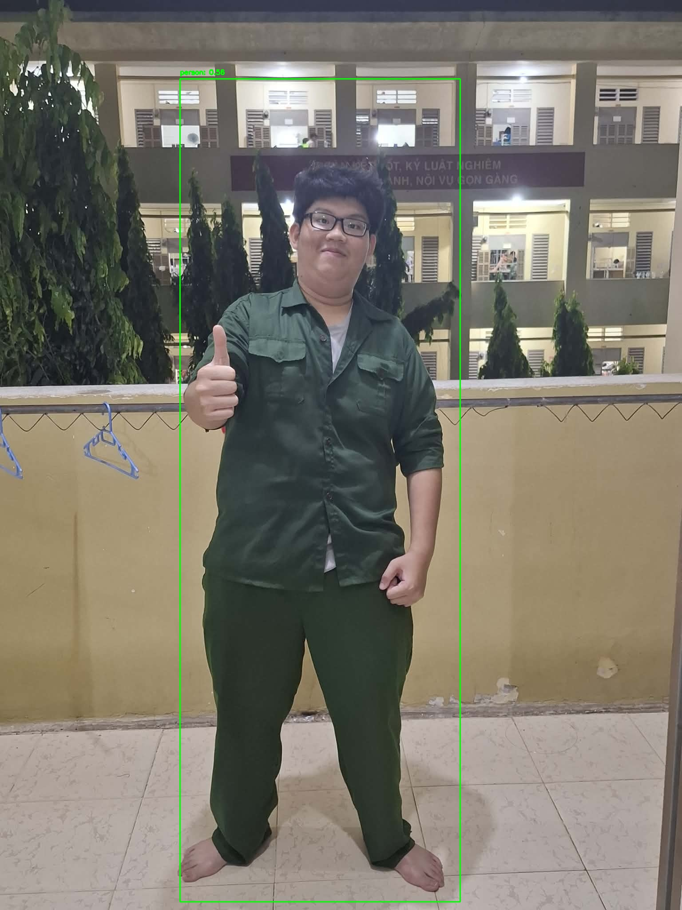

<div align="center">



# YOLOv1 
A recreation of the original YOLOv1 paper with modern techniques for faster training and better accuracy

This repo is mainly written in VietNamese, if you want to discuss it further (English or VietNamese is fine)

Contact : nghiepphat4@gmail.com
</div>

---

## Bài toán
YOLOv1 trong repo này được xây dựng cho bài toán Object detection đơn giản (single class classification). Mô hình giải quyết bài toán Bounding box regression và Classification trong cùng một mạng neuron (You only look once)

---
## Features 
-  **Architecture**: Cung cấp 2 lựa chọn kiến trúc linh hoạt:
  - `model.py` : Sử dụng ResNet50 (train from scratch) kết hợp với SE block(Squeeze-and-Excitation) và YOLOv1 detection head.
  - `model_pretrained.py` : Sử dụng ResNet34 (pre-trained trên ImageNet) kết hợp vùng với SE block và YOLOv1 detection head.
-  **Optimizations**: Automatic Mixed Precission và pin_memory = True cho DataLoader
-  **Dataset**: Pascal VOC 2012
- **Post-processing**: 
  -  Hàm Loss của YOLOv1 từ đầu (localization loss, classification loss, object conf/noobj conf)
  - Non-Maximum Suppression (NMS)
  - mAP (Mean Average Precision)

---
## Huấn luyện
- Mô hình được huấn luyện trên laptop GPU RTX 4050 hoàn toàn offline
- Mô hình sử dụng epoch train chứ không dùng batch learning như paper gốc, số epochs = 20

---
## Kết quả / Performance
- mAP (Mean Average Precision): Đạt 0.2016 (20.16%) chỉ sau một thời gian ngắn.
- loss : đạt 3.1015 sau 20 epochs

---
## Hyperparameter
- Image size : 448x448
- Reduction : 16 (từ bài báo gốc của SE Net)
- S, B, C : 7, 2, 20 (tức 7x7 grid, 2 bounding box mỗi cell và mỗi cell dự đoán ra vector có 20 thành phần) từ YOLOv1 gốc 
- Dropout : 0.5 
- lr : 1e-3 cho 10 epoch đầu tiên, giúp mô hình học nhanh và tương đối overfit trước 
- lr : 2e-4 từ epoch 11 trở đi để mô hình tập trung fine tune và học kĩ càng hơn, không phá các parameter trước đó của ResNet34
- weight_decay : 2e-4 tránh overfit
- scheduler : step_size=5, gamma=0.5
- lambda_coord, lambda_noobj : 5, 0.5 từ bài báo gốc
- IOU threshhold : 0.4 số liệu này được tôi tự dựng và đang thử nghiệm trước

---
## Ưu điểm kỹ thuật
1. SE block (Squeeze-and-Excitation): 
   Việc tích hợp SE block giúp mạng tự chú ý (attention) vào những channel đặc trưng quan trọng nhất. Điều này giúp mô hình giảm loss cực kỳ nhanh chóng ngay ở các epoch đầu tiên. Mô hình có thể nhận biết vật ở xa, ở gần camera và ảnh với nhiều resolution khác nhau, phù hợp cho Multi-scale training của YOLOv2
   
2. ResNet34: 
   Kiến trúc ResNet34 tận dụng Batch Normalization và Residual Connections giúp mô hình học cực kỳ hiệu quả những feature phức tạp, đồng thời giữ được long term dependencies. 
   Việc dùng Pre-trained weights từ ImageNet giúp phần bộ xương backbone chuyển giao fine-tune đặc trưng hình vát/góc/điểm cực kỳ rõ ràng và sắc nét. Việc sử dụng Batch Norm và Residual connection kết hợp mô hình pretrain giúp ích rất rõ mAP, khi tăng từ 0.0165 (ResNet50 - 40 epochs) lên tới 0.2016 (ResNet34 - 20 epochs)

3. Freeze / Unfreeze weights : 
   Mô hình có thêm hàm Freeze / Unfreeze để detection head (lớp fully connected cuối cùng) để mô hình có thể tập trung huấn luyện tập trung ở 10 epoch đầu tiên. Sau đó mới bắt đầu fine-tune backbone ResNet34 ở epoch 11 trở đi

---
## Nhược điểm kỹ thuật
1. Single class classification
   Việc mô hình YOLOv1 chỉ sử dụng cho bài toán single calss classification làm ảnh hưởng tới dự đoán các ảnh mà có nhiều hơn một object / label. Ngoài ra việc mô hình chỉ có thể predict được tối đa 98 bbx (2 bbx cho 1 cell) ảnh hưởng trực tiếp tới khả năng dự đoán multi-label objects. Chẳng hạn như một ảnh mà có nhiều người đứng thành một hàng thì mô hình sẽ vẽ một bounding box lớn bao hoàn toàn hàng mà không thể detet từng người một, thậm chí nếu mAP quá thấp (giống như repo này) thì mô hình còn không xuất ra bounding box. Một vấn để khác chính là việc YOLOv1 khó detect các object nhỏ (do thiếu bbx) và không có SPP (Spatial Pyramid Pooling) nhưng điều này đã được hỗ trơ một phần nhờ SE Block 

2. Hàm loss của YOLOv1
   Hàm loss cua3 YOLOv1 cực kì phức tạp và nhiệt điểm lớn nhất chính là việc sử dụng SME (sum squared error). Hơn thế, mô hình vẫn còn penalize các tọa độ tâm bbx lớn và bbx nhỏ gần như nhau cho dù tác giả đã sử dụng sqrt(w) và sqrt(h). Ngoài ra, với việc nhân hệ số lambda_coord = 5 sẽ penalize rất nặng các prediction sai, khiến hàm loss cực kì cao ở các epoch đầu tiên (5-10 epoch)
   
3. Kém linh hoạt với tỷ lệ khung hình mới (Aspect Ratios)
   YOLOv1 dự đoán trực tiếp tọa độ mà không sử dụng Anchor Boxes (như Faster R-CNN hay YOLOv2). Do đó, khi đối mặt với vật thể có tỷ lệ dài/rộng bất thường chưa có trong tập train, nó dễ phát hiện sai

4. Dữ liệu cho fine-tuning không quá nhiều
   Bài toán Object Detection không có quá nhiều label (trong Pascal VOC 2012 chỉ có 20 labels). Việc này dẫn đến các tham số của bộ lọc chưa được quá tối ưa và rất khó để co thể tự pretrain từ đầu. Ngoài ra, việc backbone ResNet34 được pretrain trên ảnh 224x224 và trực tiếp finet-tune 448x448 ảnh hưởng lớn tới các tham số của backbone do backbone chưa hề quen với các ảnh có resolution cao hơn

---
## Các cải tiến từ các bài báo sau này
Tuy mang tính đột phá về tốc độ, kiến trúc YOLOv1 vẫn tồn tại một số hạn chế nội tại:

1. Multi-label classification
   Mô hình YOLOv2 có nhiều bbx hơn (845) vì vậy có thể detect nhiều hơn các vật thể

2. Anchor box
   Việc sử dụng Anchor Box từ YOLOv2 trở đi giúp ích rất nhiều tới tài nguyên tính toán và mAP của mô hình khi thay vì phải tự predict toàn bộ bbx, mô hình chỉ cần dự đoán các offset từ các Anchor Box có sẵn. Sau này với YOLOv11, mô hình lại quay trở lại với predict hoàn toàn các bbx

3. Dữ liệu dồi dào hơn 
   Mô hình YOLOv2 sử dụng WordTree để có thể extend thêm từ bộ dữ liệu ImageNet để tăng số lượng label cho COCO

4. Data Augmentation
   Mô hình YOLOv1 trong repo không sử dụng tới Augmentation qua thư viện albumentations. Nếu bạn thích, bạn có thể thử nghiệm với ColorJitter và Horizontal/Vertical Flip để giúp mô hình fine-tune tốt hơn

5. Cơ chế attention
   SE Block trong repo là một cơ chế attention cực kì đơn giản và có thể extend hơn thành các cơ chế attention khác như của YOLOv5 kết hợp với Vision Transformer

5. Các cải tiến khác 
   Các cập nhật khác trong tương lai sẽ được tôi cập nhật khi tôi tìm hiểu tới các paper và tài liệu khác. Mong bạn sẽ đồng hành với tôi 

---
## Project Structure (Cấu trúc Thư mục)

```text
├── dataset.py            # Script xử lý PASCAL VOC Dataset và Dataloader
├── utils.py              # Xử lý NMS, mAP và Convert tọa độ Bounding Boxes
├── model.py              # YOLOv1 Architecture (ResNet50 + SE Block)
├── model_pretrained.py   # YOLOv1 Architecture (ResNet34 Pretrained + SE Block)
├── train.py              # Pipeline huấn luyện chính với AMP & Optimizer
├── predict.py            # Pipeline dự đoán ảnh thực tế trực tiếp
├── output_detection.jpg  # Ảnh kết quả minh họa (Prediction)
└── .gitignore            # Git ignore configs
```

---

## Quick Start

### 1. Cài đặt môi trường
Đảm bảo bạn đã cài đặt đủ các thư viện cần thiết trước khi bắt đầu:
```bash
pip install torch torchvision opencv-python tqdm albumentations
```

### 2. Huấn luyện mô hình (Training)
Để bắt đầu đào tạo mô hình từ đầu hoặc tiếp tục từ một Checkpoint có sẵn (`best_yolo_model.pth`):
```bash
python train.py
```

### 3. Suy luận (Predict / Inference)
Chạy mô hình trên một bức ảnh bất kỳ của bạn để xem khả năng nhận diện:
```bash
python predict.py --image your_image.jpg
```

<br>
<div align="center">
<i>Nếu các bạn thấy hữu ích, cho tôi xin một sao nhé. Cảm ơn các bạn đã ủng hộ! ⭐️</i>
</div>